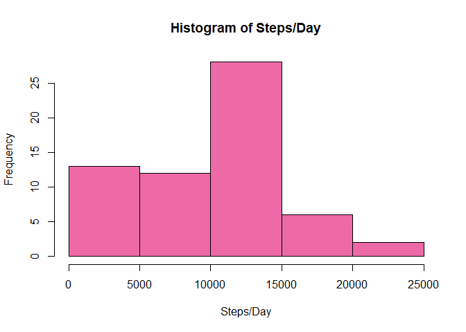
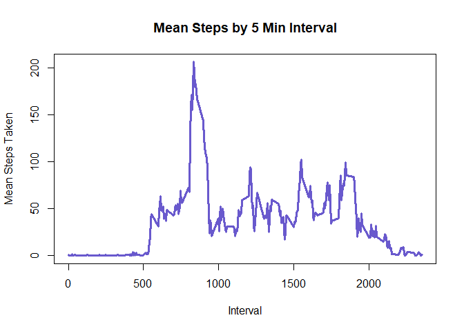
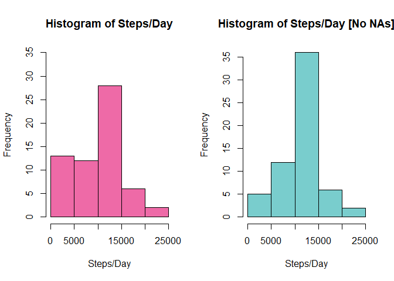
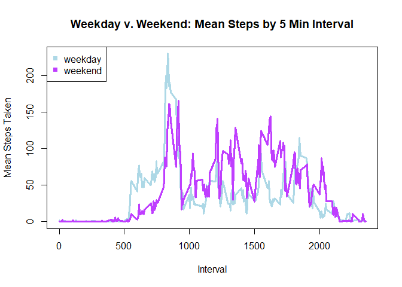

## Loading and preprocessing the data

```r
setwd("C:/Users/T470/Desktop/Coursera/Data Science/Reproducible Research/RepData_PeerAssessment1/data")
am <- read.csv("activity.csv")
```
## What is mean total number of steps taken per day?

#### First, generate DF with total steps per day

```r
am1 <- with(am,tapply(steps,date,sum,na.rm=T))
am2 <- data.frame(date=row.names(am1),steps=as.integer(am1))
```

#### Next, plot histogram of steps per day

```r
hist(am2$steps, main = "Histogram of Steps/Day",xlab="Steps/Day",ylab="Frequency", col="hotpink2")
```

<!-- -->

#### Finally, Calc mean and med of steps per day

```r
am2_mean <- round(mean(am2$steps),2)
am2_med <- median(am2$steps)
```
The mean steps per day is **9354.23** and the median is **10395**


## What is the average daily activity pattern?

####First, generate DF with avg steps per interval

```r
am3 <- with(am,tapply(steps,interval,mean,na.rm=T))
am4 <- data.frame(interval=row.names(am3),steps=as.integer(am3))
am4$interval <- as.character(am4$interval)
```

#### Then plot by interval

```r
plot(am4$interval,am4$steps,type="l",col="slateblue3",
     xlab="Interval",ylab="Mean Steps Taken", 
     lwd=3, main="Mean Steps by 5 Min Interval")
```

<!-- -->

#### Find interval with max steps on avg

```r
am4_max <- am4[am4$steps==max(am4$steps),1]
print(am4_max)
```

```
## [1] "835"
```

## Imputing missing values

#### Missing data was imputed by replacing it with the interval avg steps taken
#### The first step was to count missing vals

```r
am_na <- sum(is.na(am))
print(am_na)
```

```
## [1] 2304
```

#### Replace missing vals with avg interval value then recreate DF

```r
am5 <- merge(am,am4,by="interval")

for (i in 1:nrow(am5)){
  if (is.na(am5[i,2])){
    am5[i,2]<-am5[i,4]
  }
}

am_xna <- am5[,1:3]
colnames(am_xna) <- c("interval","steps","date")
```

#### Show new Histogram with NAs replaced

```r
#re-average steps per day
#sum steps by day
am1_xna <- with(am_xna,tapply(steps,date,sum,na.rm=T))
am2_xna <- data.frame(date=row.names(am1_xna),steps=as.integer(am1_xna))

# 7.) Plot histogram of steps/day
par(mfrow=c(1,2))
hist(am2$steps, main = "Histogram of Steps/Day",xlab="Steps/Day",ylab="Frequency", col="hotpink2",ylim=c(0,35))
hist(am2_xna$steps, main = "Histogram of Steps/Day [No NAs]",xlab="Steps/Day",ylab="Frequency", col="darkslategray3")
```

<!-- -->

#### Recalc mean and med

```r
am2_xna_mean <- mean(am2_xna$steps)
print(am2_xna_mean)
```

```
## [1] 10749.77
```

```r
am2_xna_med <- median(am2_xna$steps)
print(am2_xna_med)
```

```
## [1] 10641
```


## Are there differences in activity patterns between weekdays and weekends?

#### Generate a plot showing weekend and weekday patterns together


```r
#create factor 
am_xna$day <- as.factor(ifelse(weekdays(as.Date(as.character(am_xna$date))) %in% 
                                 c("Saturday","Sunday"),"weekend","weekday"))

#weekdays
am_w <- subset(am_xna,day=="weekday",select=c("interval","steps"))
am_w1 <- with(am_w,tapply(steps,interval,mean,na.rm=T))
am_w1 <- data.frame(interval=row.names(am_w1),steps=as.integer(am_w1))
am_w1$interval <- as.character(am_w1$interval)

#weekends
am_we <- subset(am_xna,day!="weekday",select=c("interval","steps"))
am_we1 <- with(am_we,tapply(steps,interval,mean,na.rm=T))
am_we1 <- data.frame(interval=row.names(am_we1),steps=as.integer(am_we1))
am_we1$interval <- as.character(am_we1$interval)

plot(am_w1$interval,am_w1$steps,type="l",col="lightblue",
     xlab="Interval",ylab="Mean Steps Taken", 
     lwd=3, main="Weekday v. Weekend: Mean Steps by 5 Min Interval")
lines(am_we1$interval,am_we1$steps,type="l",col="darkorchid1",
     lwd=3)
legend("topleft",c("weekday","weekend"),col=c("lightblue","darkorchid1"),pch = c(15,15))
```

<!-- -->

